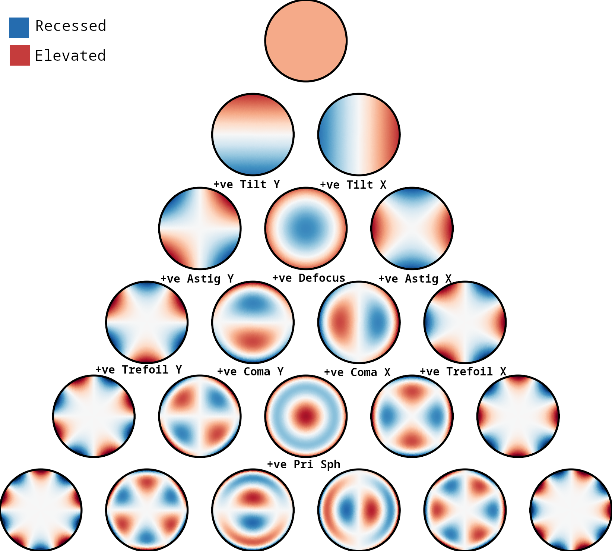
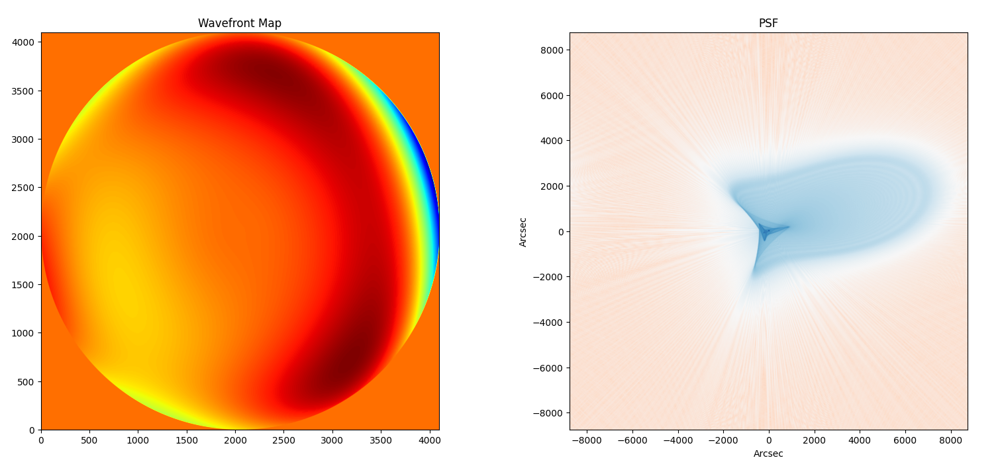

# PSF Generator from Zernike Coefficients

Generate PSFs from Zernike Coefficients with `psf_generator_cartesian.py`. Also, generate wavefront map for unit circle.
Zernike Coefficients are in units of nanometers (nm).

Steps:
- Wavefront map is generated from a list of Zernike Coefficients.
- We use [Piston, TiltX, TiltY, Defocus, AstigX, AstigY, PrimarySph, TrefoilX, TrefoilY]
- PSF is given by the square of the absolute value of the FFT of complex pupil function.
- The complex pupil function is generated with the Zernike Coefficients.

## Reference wavefront maps

The code generated wavefront maps are of the nature listed in the image below.

## Acknowledgements

 - [IUCAA, Pune](https://www.iucaa.in)
 - [ISRO, Aditya-L1](https://www.isro.gov.in/Aditya_L1.html)

## Authors

- [@janmejoysarkar](https://github.com/janmejoysarkar)

## Screenshots

